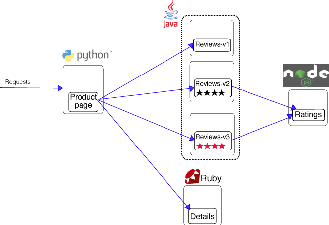

footer: Istio by Example, @adersberger, KubeCon & CloudNativeCon EU 2018
background-color: 283D8F


[.hide-footer]

---

# Why?

---


^ because it's the hottest shit on earth

[.hide-footer]

---


# Safe Harbor Statement: There are other service meshes than Istio out there like Linkerd and Conduit

^ because it's the hottest shit on earth

[.hide-footer]

---

# no more microservice lib bloat -> provided by infrastructure

---


^ 
 * Pilot: Configures Mixer and Envoys at runtime
 * Envoy: Sidecar proxy per microservice that handles ingress/egress traffic
 * Mixer: Policy enforcement (TODO)
 * Ingress/Egress: Inbound and outbound gateway (TODO)
 * Istio CA: CA for service-to-service authx and encryption

[.hide-footer]

---
[.background-color: #FFFFFF]

# Sample Application: BookInfo[^1]



[^1]: Istio BookInfo Sample (https://istio.io/docs/guides/bookinfo.html) 

^
The BookInfo sample application deployed is composed of four microservices:

1) The productpage microservice is the homepage, populated using the details and reviews microservices.
2) The details microservice contains the book information.
3) The reviews microservice contains the book reviews. It uses the ratings microservice for the star rating. Default: load-balance between versions.
4) The ratings microservice contains the book rating for a book review.

The deployment included three versions of the reviews microservice to showcase different behaviour and routing:

1) Version v1 doesn’t call the ratings service.
2) Version v2 calls the ratings service and displays each rating as 1 to 5 black stars.
3) Version v3 calls the ratings service and displays each rating as 1 to 5 red stars.

The services communicate over HTTP using DNS for service discovery.

[.hide-footer]

---
# Setup

 ```zsh, [.highlight: 2]
 curl -L https://git.io/getLatestIstio | sh -
 cd istio-0.7.1
 export PATH=$PWD/bin:$PATH
 kubectl apply -f install/kubernetes/istio.yaml
```

---

# Ingress

 ```zsh
apiVersion: extensions/v1beta1
kind: Ingress
metadata:
  name: gateway
  annotations:
    kubernetes.io/ingress.class: "istio"
spec:
  rules:
  - http:
      paths:
      - path: /productpage
        backend:
          serviceName: productpage
          servicePort: 9080
      - path: /login
        backend:
          serviceName: productpage
          servicePort: 9080
      - path: /logout
        backend:
          serviceName: productpage
          servicePort: 9080
      - path: /api/v1/products.*
        backend:
          serviceName: productpage
          servicePort: 9080
```
[.hide-footer]

---
# Release Patterns[^1]


[^1]: B. Ibryam and R. Huss, Kubernetes Patterns, https://leanpub.com/k8spatterns

http://blog.christianposta.com/deploy/blue-green-deployments-a-b-testing-and-canary-releases/

---

Istio Playground: Use Katacoda!

https://www.katacoda.com/courses/istio

---


[.hide-footer]
