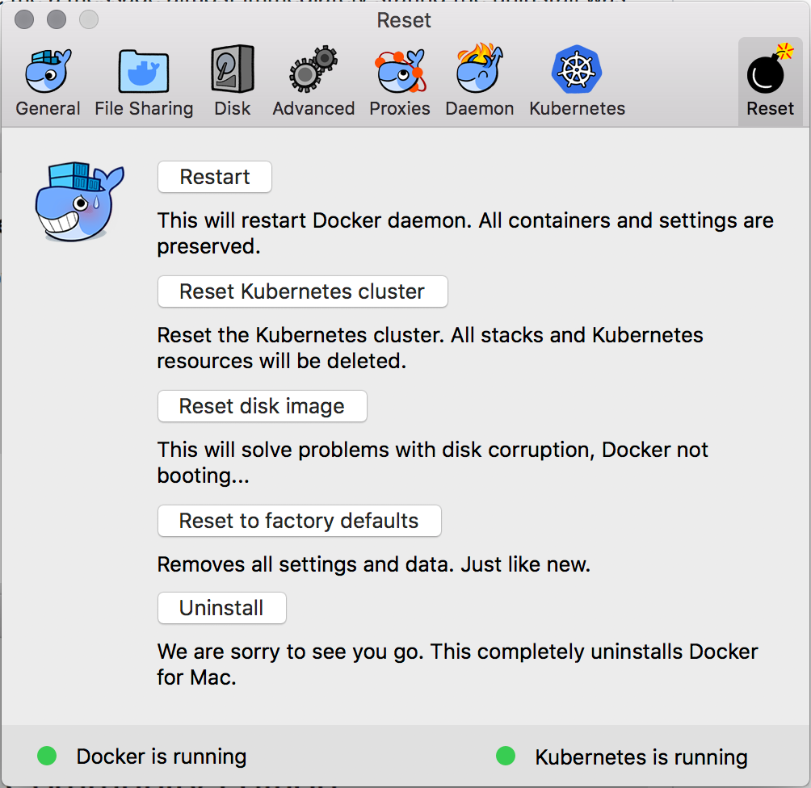
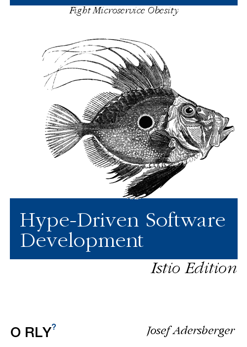
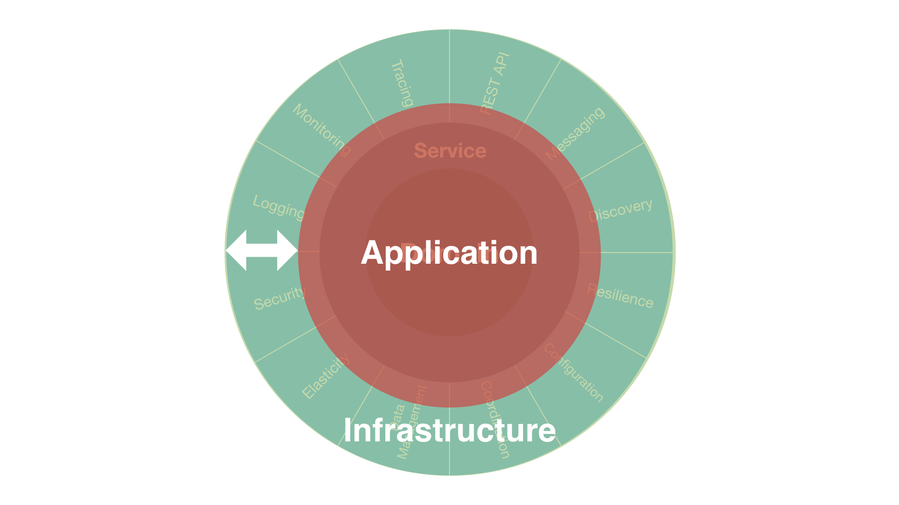
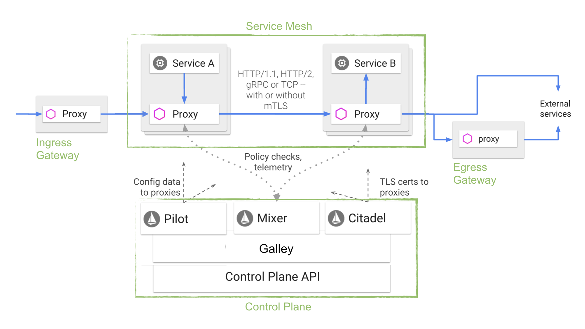
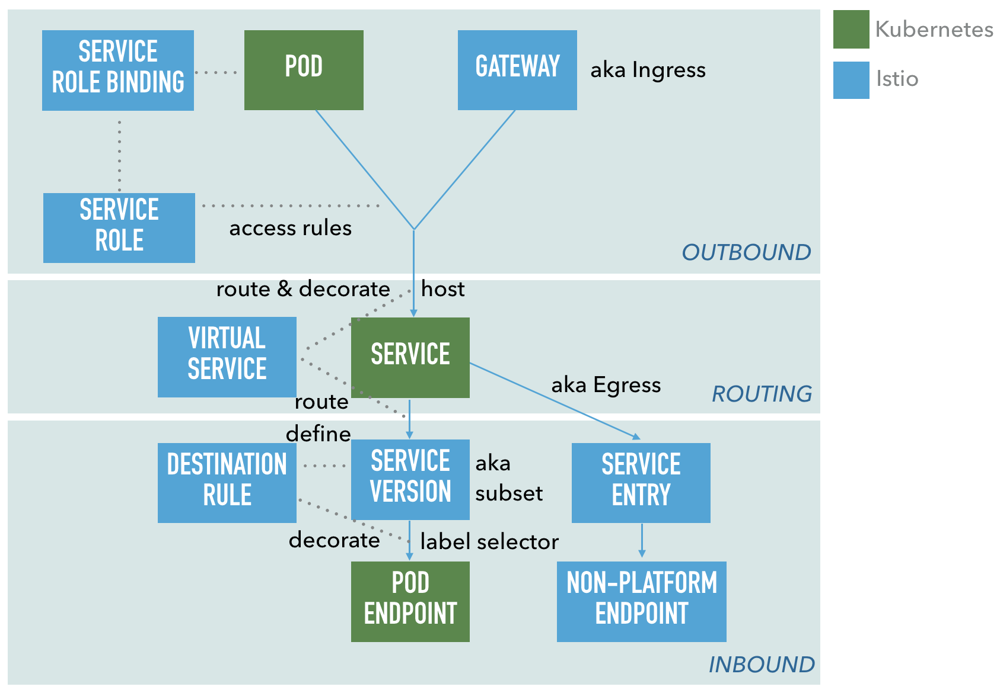
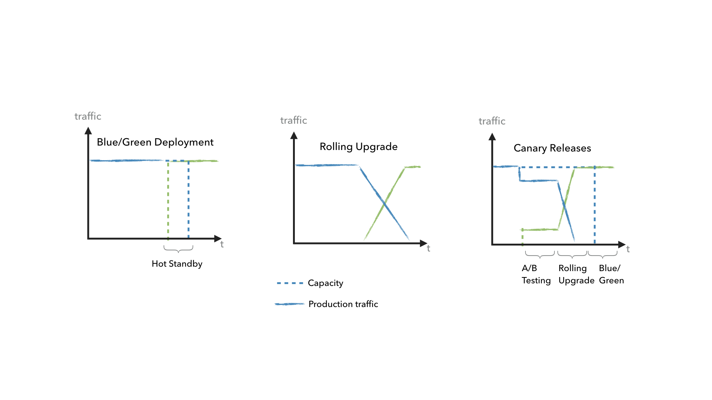

background-color: 283D8F

# Istio Playground


@adersberger @qaware

^ Istio service mesh is a thrilling new tech that helps getting a lot of technical stuff out of your microservices (circuit breaking, observability, mutual-TLS, ...) into the infrastructure - for those who are lazy (aka productive) and want to keep their microservices small. Come one, come all to the Istio playground: (1) we provide a ready-to-use Kubernetes cluster (2) we guide you through the installation of Istio (3) we bring a small Spring Cloud sample application (4) we provide assistance in the case you get stuck ... and it's up to you to explore and tinker with Istio on your own paths and with your own pace. 

---

# Our network today

 * Optimize first: Switch network off and on again and use 5GHz networking
 * Plan A: Local installation
 * Plan B: Use GKE clusters
 * Plan C: Use Katacoda
 * Plan D: Steamworks


---
# Workshop Prerequisites

 * Bash
 * git Client
 * Text editor (like VS.Code)

---
# Baby Step: Grab the Code

```sh
git clone https://github.com/adersberger/istio-playground

cd istio-playground/code
```

---
# Baby Step: Install a (local) Kubernetes Cluster


https://www.docker.com/community-edition

 * Preferences: enable Kubernetes
 * Preferences: increase resource usage to 3 cores and 8 GB memory

^ 
it all begins with a k8s cluster
For minikube users: minikube addons enable ingress

---
# The Ultimate Guide to Fix Strange Kubernetes Behavior



---
# Setup Kubernetes Environment
 ```sh
# Switch k8s context
kubectl config use-context docker-for-desktop
# Deploy k8s dashboard
kubectl create -f https://raw.githubusercontent.com/kubernetes/dashboard/master/src/deploy/recommended/kubernetes-dashboard.yaml
# Extract id of default service account token (referred as TOKENID)
kubectl describe serviceaccount default
# Grab token and insert it into k8s Dashboard UI auth dialog
kubectl describe secret TOKENID
# Start local proxy
kubectl proxy --port=8001 &
# Open k8s Dashboard
open http://localhost:8001/api/v1/namespaces/kube-system/services/https:kubernetes-dashboard:/proxy/#!/login
 ```

^ attention: on some terminals you have to remove blank lines before pasting the token

---
# Deploy Istio

 ```zsh
curl -L https://git.io/getLatestIstio | sh -
cd istio-1.0.1
export PATH=$PWD/bin:$PATH
istioctl version

# deploy Istio
# (demo setting, default deployment is via Helm)
kubectl apply -f install/kubernetes/istio-demo.yaml
kubectl get pods -n istio-system

# label default namespace to be auto-sidecarred
kubectl label namespace default istio-injection=enabled
kubectl get namespace -L istio-injection
```
^ or manual download if no curl command is available
https://github.com/istio/istio/releases. 
Hint: Since Istio release 0.8 you can substitute `istioctl` with `kubectl`. We're still using `istioctl` for clarity purposes.

---

# Deploy Sample Application (BookInfo)

```zsh
kubectl apply -f samples/bookinfo/platform/kube/bookinfo.yaml
kubectl get pods
istioctl create -f samples/bookinfo/networking/bookinfo-gateway.yaml
istioctl get gateways
open http://localhost/productpage
```

---

#Hands-on


---

# Why?

---


---



^ 
Istio and service meshes are a hype right now - but this sustainable kind of hype driven by the fact the things are getting easier and less complex.

---

# Atomic Architecture


---


^ 
microservice applications do have a lot of crosscutting concerns to address to be cloud native

---


^ 
these concerns can be addressed by libraries

---
# Library Bloat


^ 
but this leads to a library bloat

---


[.hide-footer]

---


[.hide-footer]

---



^ 
so the idea is to move those concerns from the application side to the infrastructure side

---


^ 
and this is where Istio comes up:
It unburdens cloud native applications to address crosscutting concerns by themselves. Messaging will be addressed by Knative or NATS.

---
#Setting the Sails with Istio 1.0.1


^ 
now let's dig into Istio - example by example
first task is to setup a Istio mesh

---


^ 
* Envoy: Sidecar proxy per microservice that handles inbound/outbound traffic within each Pod. Extended version of Envoy project.
* Gateway: Inbound gateway / ingress. Nothing more than an managed Envoy.
* Mixer: Policy / precondition checks and telemetry. Highly scalable. Envoy caches policy checks within the sidecare (level 1) and within envoy instances (level 2),  buffers telemetry data locally and centrally, and can be run in multiple instances. Mixer includes a flexible plugin model. 
https://istio.io/blog/2017/mixer-spof-myth.html
* Pilot: Pilot converts high level routing rules that control traffic behavior into Envoy-specific configurations, and propagates them to the sidecars at runtime.
Watches services and transforms this information in a canonical platform-agnostic model (abstracting away from k8s, Nomad, Consul etc). The envoy configuration is then derived from this canonical model. Exposes the Rules API to add traffic management rules.
* Citadel: CA for service-to-service authx and encryption. Certs are delivered as a secret volume mount. Workload identity is provided in SPIFFE format.
https://istio.io/docs/concepts/security/mutual-tls.html

[.hide-footer]
---
# Istio Abstractions



^ https://istio.io/docs/concepts/traffic-management/

---

# Sample Application: BookInfo[^1]


[^1]: Istio BookInfo Sample (https://istio.io/docs/examples/bookinfo) 

^
The BookInfo sample application deployed is composed of four microservices:

1) The productpage microservice is the homepage, populated using the details and reviews microservices.
2) The details microservice contains the book information.
3) The reviews microservice contains the book reviews. It uses the ratings microservice for the star rating. Default: load-balance between versions.
4) The ratings microservice contains the book rating for a book review.

The deployment included three versions of the reviews microservice to showcase different behaviour and routing:

1) Version v1 doesn’t call the ratings service.
2) Version v2 calls the ratings service and displays each rating as 1 to 5 black stars.
3) Version v3 calls the ratings service and displays each rating as 1 to 5 red stars.

The services communicate over HTTP using DNS for service discovery.

Login is allowed with any combination of username and password.

[.hide-footer]
[.background-color: #898787]

---


---
# Bookinfo: Gateway
```yaml
apiVersion: networking.istio.io/v1alpha3
kind: Gateway
metadata:
  name: bookinfo-gateway
spec:
  selector:
    istio: ingressgateway # use istio default controller
  servers:
  - port:
      number: 80
      name: http
      protocol: HTTP
    hosts:
    - "*"
```

---
# Bookinfo: VirtualService
```yaml
apiVersion: networking.istio.io/v1alpha3
kind: VirtualService
metadata:
  name: bookinfo
spec:
  hosts:
  - "*"
  gateways:
  - bookinfo-gateway
  http:
  - match:
    - uri:
        exact: /productpage
    - uri:
        exact: /login
    - uri:
        exact: /logout
    - uri:
        prefix: /api/v1/products
    route:
    - destination:
        host: productpage
        port:
          number: 9080
```
---
# Bookinfo: DestinationRule
```yaml
apiVersion: networking.istio.io/v1alpha3
kind: DestinationRule
metadata:
  name: productpage
spec:
  host: productpage
  subsets:
  - name: v1
    labels:
      version: v1
```

---
#Hands-on: Have a look around the YAMLs and Dashboard


---

# Expose Istio Observability Tools
 ```zsh
#Metrics: Prometheus
kubectl expose deployment prometheus --name=prometheus-expose \
  --port=9090 --target-port=9090 --type=LoadBalancer -n=istio-system

#Metrics: Grafana
kubectl expose deployment grafana --name=grafana-expose \
  --port=3000 --target-port=3000 --type=LoadBalancer -n=istio-system
open http://localhost:3000/d/1/istio-dashboard

#Tracing: Jaeger
kubectl expose deployment istio-tracing --name=tracing-expose \
  --port=16686 --target-port=16686 --type=LoadBalancer -n=istio-system
open http://localhost:16686

#Tracing: ServiceGraph
kubectl expose service servicegraph --name=servicegraph-expose \
  --port=8088 --target-port=8088 --type=LoadBalancer -n=istio-system
open http://localhost:8088/force/forcegraph.html
open http://localhost:8088/dotviz
```

---

# Deploy Missing Observability Feature: Log Analysis (EFK)

 ```zsh
cd .. #go to istio-playground/code
kubectl apply -f logging-stack.yaml
kubectl get pods -n=logging
kubectl expose deployment kibana --name=kibana-expose \
  --port=5601 --target-port=5601 --type=LoadBalancer -n=logging
istioctl create -f fluentd-istio.yaml
```

^ see https://istio.io/docs/tasks/telemetry/fluentd

---

# Deploy Missing Observability Feature: Log Analysis (EFK)

 ```zsh
open http://localhost:5601/app/kibana
```

 * Perform some requests to the BookInfo application
 * Use `*` as the index pattern
 * Select `@timestamp` as the time filter field name

---
# fluentd-istio.yaml (1/3)
```zsh
# Configuration for logentry instances
apiVersion: "config.istio.io/v1alpha2"
kind: logentry
metadata:
  name: newlog
  namespace: istio-system
spec:
  severity: '"info"'
  timestamp: request.time
  variables:
    source: source.labels["app"] | source.service | "unknown"
    user: source.user | "unknown"
    destination: destination.labels["app"] | destination.service | "unknown"
    responseCode: response.code | 0
    responseSize: response.size | 0
    latency: response.duration | "0ms"
  monitored_resource_type: '"UNSPECIFIED"'
```
---
# fluentd-istio.yaml (2/3)
```zsh
# Configuration for a fluentd handler
apiVersion: "config.istio.io/v1alpha2"
kind: fluentd
metadata:
  name: handler
  namespace: istio-system
spec:
  address: "fluentd-es.logging:24224"
```
---
# fluentd-istio.yaml (3/3)
```zsh
# Rule to send logentry instances to the fluentd handler
apiVersion: "config.istio.io/v1alpha2"
kind: rule
metadata:
  name: newlogtofluentd
  namespace: istio-system
spec:
  match: "true" # match for all requests
  actions:
   - handler: handler.fluentd
     instances:
     - newlog.logentry
```

---

# Stimulate!
 ```zsh
slapper -rate 4 -targets ./target -workers 2 -maxY 15s
 ```

Download from: https://github.com/adersberger/slapper/releases/tag/0.1

^ 
now let's stimulate the sample application and have a look on what we can observe
with this stack in place you're now able to play around with Istio
I'm coming to an end by flipping through the toys you can use. Key bindings:
q, ctrl-c - quit
r - reset stats
k - increase rate by 100 RPS
j - decrease rate by 100 RPS

---
# Slapper[^2] in action


[^2]: Key bindings:
q, ctrl-c - quit
r - reset stats
k - increase rate by 100 RPS
j - decrease rate by 100 RPS

---
#Hands-on


---
# Observability Outlook: Kiali


---
# Observability Outlook: Kiali (macOS setup)
 ```zsh
brew install gettext
brew link --force gettext
# follow k8s setup guide: https://www.kiali.io/gettingstarted
kubectl expose deployment kiali --name=kiali-expose \
  --port=20001 --target-port=20001 --type=LoadBalancer -n=istio-system
open http://localhost:20001
# login with admin/admin
```
---
# Release Patterns



^
B. Ibryam and R. Huss, Kubernetes Patterns, https://leanpub.com/k8spatterns
(1) Blue/Green: Two deployments in parallel for fast rollbacks. Switch traffic to new version but undeploy old version later when you are confident that the new version works.
(2) Rolling Upgrades: Gradually shifting traffic from one version to another version
(3) Canary Releases: First perform an A/B test between the old and the new version. If this is successful perform a rolling upgrade ending with a blue/green deployment. (champions league of deployment patterns)


[.hide-footer]

---

# Sample Application Recap


---
# Sample Desination Rule

```yaml
apiVersion: networking.istio.io/v1alpha3
kind: DestinationRule
metadata:
  name: reviews
spec:
  host: reviews
  subsets:
  - name: v1
    labels:
      version: v1
  - name: v2
    labels:
      version: v2
  - name: v3
    labels:
      version: v3
```

---
# Canary Releases: A/B Testing

 ```yaml
apiVersion: networking.istio.io/v1alpha3
kind: VirtualService
metadata:
  name: reviews
spec:
  hosts:
    - reviews
  http:
  - match:
    - headers:
        end-user:
          exact: jason
    route:
    - destination:
        host: reviews
        subset: v2
  - route:
    - destination:
        host: reviews
        subset: v1
```
^ 
Send all traffic for the user "jason" to the reviews:v2, meaning they'll only see the black stars. 
Difference to Kubernetes: Istio is on Service-level, Kubernetes more on Pod-level

---
# Canary Releases: A/B Testing

```zsh

cd istio-1.0.1

istioctl create -f samples/bookinfo/networking/virtual-service-all-v1.yaml

istioctl create -f samples/bookinfo/networking/destination-rule-all.yaml

istioctl replace -f samples/bookinfo/networking/virtual-service-reviews-test-v2.yaml

#open BookInfo application and login as user jason (password jason)
open http://localhost/productpage
```

 * login as "jason" / "jason" leads to v2 (black stars)
 * anonymous user leads to v1 (no stars)

---
# Canary Releases: Rolling Upgrade

 ```yaml
apiVersion: networking.istio.io/v1alpha3
kind: VirtualService
metadata:
  name: reviews
spec:
  hosts:
    - reviews
  http:
  - route:
    - destination:
        host: reviews
        subset: v1
      weight: 50
    - destination:
        host: reviews
        subset: v3
      weight: 50
```
```zsh
istioctl replace -f samples/bookinfo/networking/virtual-service-reviews-50-v3.yaml
```
^
The rule above ensures that 50% of the traffic goes to reviews:v1 (no stars), or reviews:v3 (red stars).

---
# Canary Releases: Blue/Green
 ```yaml
apiVersion: networking.istio.io/v1alpha3
kind: VirtualService
metadata:
  name: reviews
spec:
  hosts:
    - reviews
  http:
  - route:
    - destination:
        host: reviews
        subset: v3
```
```zsh
istioctl replace -f samples/bookinfo/networking/virtual-service-reviews-v3.yaml
istioctl get routerules
```
---
#Hands-on


---
Time to Play!


| Traffic Management | Resiliency | Security | Observability |
| --- | --- | --- | --- |
| Request Routing | Timeouts | mTLS | Metrics |
| Load Balancing | Circuit Breaker | Role-Based Access Control | Logs |
| Traffic Shifting | Health Checks (active, passive) | Workload Identity | Traces|
| Traffic Mirroring | Retries | Authentication Policies |  |
| Service Discovery | Rate Limiting | CORS Handling |  |
| Ingress, Egress | Delay & Fault Injection | TLS Termination, SNI |  |
| API Specification | Connection Pooling  |  |  |
| Multicluster Mesh |  |  |  |

https://istio.io/docs/tasks
https://istio.io/about/feature-stages

---
#Hands-on


---


---
#FAQ

*Q: How does the Envoy proxy intercept requests?*
A: With IPtable rules (alls rules pointing to envoy)
*Q: How does the auto-sidecar magic work?*
A: With an Istio admission controller enhancing the deployments
*Q: How can I list all Istio custom resource definitions and commands?*
A: `kubectl api-resources`
*Q: I can't see any metrics, logs, traces. What should I do?*
A: Restart `istio-telemetry` Deploment or `kubectl replace -f fluentd-istio.yaml`