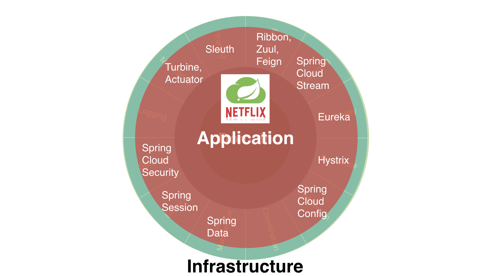
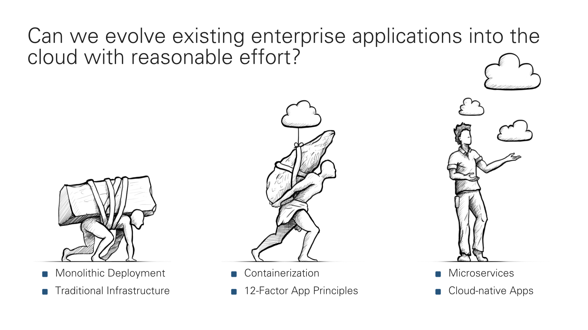
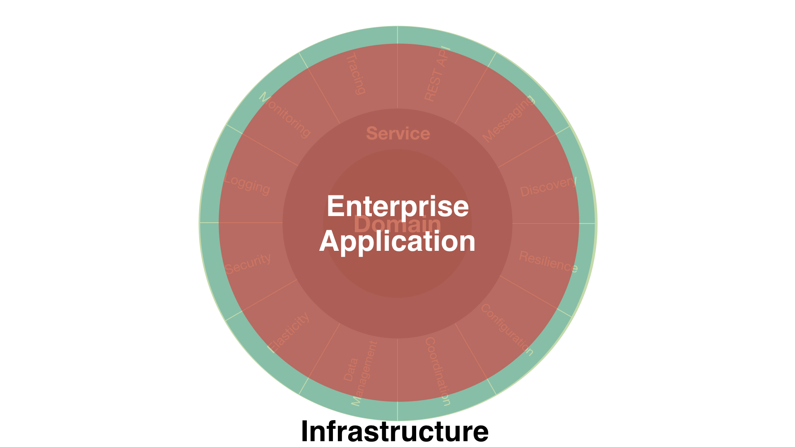
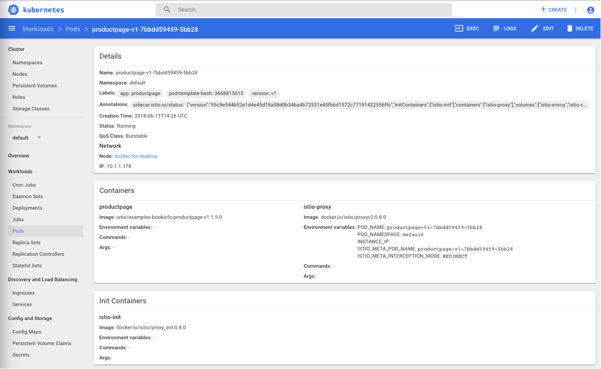
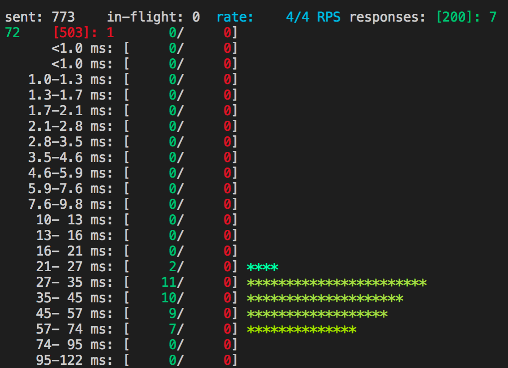
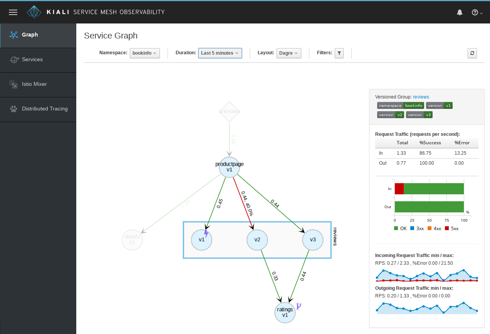

background-color: 283D8F

# Istio Playground


@adersberger @qaware

^ Istio service mesh is a thrilling new tech that helps getting a lot of technical stuff out of your microservices (circuit breaking, observability, mutual-TLS, ...) into the infrastructure - for those who are lazy (aka productive) and want to keep their microservices small. Come one, come all to the Istio playground: (1) we provide a ready-to-use Kubernetes cluster (2) we guide you through the installation of Istio (3) we bring a small Spring Cloud sample application (4) we provide assistance in the case you get stuck ... and it's up to you to explore and tinker with Istio on your own paths and with your own pace. 

---

# Why?

^ 
You might ask why another Istio talk...
The answer is...

---


^ 
Istio and service meshes are a hype right now
Our job is to ground this hype by providing real-life use cases

---

# Atomic Architecture


---


^ 
microservice applications do have a lot of crosscutting concerns to address to be cloud native

---


^ 
these concerns can be addressed by libraries

---
# Library Bloat


^ 
but this leads to a library bloat

---



[.hide-footer]

---



[.hide-footer]

---



[.hide-footer]

---


^ 
so the idea is to move those concerns from the application side to the infrastructure side

---


^ 
and this is where Istio comes up:
It unburdens cloud native applications to address crosscutting concerns by themselves.

---
#Setting the Sails with Istio 0.8


^ 
now let's dig into Istio - example by example
first task is to setup a Istio mesh

---


^ 
 * Pilot: Watches services and transforms this information in a canonical platform-agnostic model. The envoy configuration is then derived from this canonical model. Exposes the Rules API to add traffic management rules (used by Istioctl).
 * Envoy: Sidecar proxy per microservice that handles ingress/egress traffic
 * Mixer: Policy / precondition checks and telemetry. Highly scalable. Envoy caches policy rules and buffers telemetry data locally.
 https://istio.io/blog/2017/mixer-spof-myth.html
 * Ingress/Egress: Inbound and outbound gateway. Nothing more than a Pod with an Envoy.
 * Istio Auth: CA for service-to-service authx and encryption. Certs are delivered as a secret volume mount. Workload identity is provided by SPIFFE.
 https://istio.io/docs/concepts/security/mutual-tls.html

[.hide-footer]

---
# Workshop Prerequisites

 * Bash
 * git Client
 * Text editor (like VS.Code)

---
# Baby Step: Grab the Code

```sh
git clone https://github.com/adersberger/istio-playground
```

---
# Baby Step: Install a (local) Kubernetes Cluster


https://www.docker.com/community-edition

 * Preferences: enable Kubernetes
 * Preferences: increase resource usage to 3 cores

^ 
it all begins with a k8s cluster

---
# The Ultimate Guide to Fix Strange Kubernetes Behavior


---
# Setup Kubernetes Environment
 ```sh
# Switch k8s context
kubectl config use-context docker-for-desktop
# Deploy k8s dashboard
kubectl create -f https://raw.githubusercontent.com/kubernetes/dashboard/master/src/deploy/recommended/kubernetes-dashboard.yaml
# Extract id of default service account token (referred as TOKENID)
kubectl describe serviceaccount default
# Grab token and insert it into k8s Dashboard UI auth dialog
kubectl describe secret TOKENID
# Start local proxy
kubectl proxy --port=8001 &
# Open k8s Dashboard
open http://localhost:8001/api/v1/namespaces/kube-system/services/https:kubernetes-dashboard:/proxy/#!/login
 ```

---
# Deploy Istio

 ```zsh
curl -L https://git.io/getLatestIstio | sh -
cd istio-0.8.0
export PATH=$PWD/bin:$PATH

# deploy Istio with mTLS enabled by default 
# (demo setting, default depplyment is via Helm)
kubectl apply -f install/kubernetes/istio-demo-auth.yaml
kubectl get pods -n istio-system

# label default namespace to be auto-sidecarred
kubectl label namespace default istio-injection=enabled
kubectl get namespace -L istio-injection
```

---
# Deploy Sample Application (BookInfo)

```zsh
kubectl apply -f samples/bookinfo/kube/bookinfo.yaml
istioctl create -f samples/bookinfo/routing/bookinfo-gateway.yaml
open http://localhost/productpage
```

---
# Deploy Sample Application (BookInfo)

```zsh
kubectl apply -f samples/bookinfo/kube/bookinfo.yaml
istioctl create -f samples/bookinfo/routing/bookinfo-gateway.yaml
open http://localhost/productpage
```

__Hint: Since Istio release 0.8 you can substitute `istioctl` with `kubectl`. We're still using `istioctl` for clarity purposes.__

---



---
# bookinfo-gateway.yaml (1/2)
```yaml
apiVersion: networking.istio.io/v1alpha3
kind: Gateway
metadata:
  name: bookinfo-gateway
spec:
  selector:
    istio: ingressgateway # use istio default controller
  servers:
  - port:
      number: 80
      name: http
      protocol: HTTP
    hosts:
    - "*"
```

---
# bookinfo-gateway.yaml (2/2)
```yaml
apiVersion: networking.istio.io/v1alpha3
kind: VirtualService
metadata:
  name: bookinfo
spec:
  hosts:
  - "*"
  gateways:
  - bookinfo-gateway
  http:
  - match:
    - uri:
        exact: /productpage
    - uri:
        exact: /login
    - uri:
        exact: /logout
    - uri:
        prefix: /api/v1/products
    route:
    - destination:
        host: productpage
        port:
          number: 9080
```
---

# Sample Application: BookInfo[^1]


[^1]: Istio BookInfo Sample (https://istio.io/docs/guides/bookinfo.html) 

^
The BookInfo sample application deployed is composed of four microservices:

1) The productpage microservice is the homepage, populated using the details and reviews microservices.
2) The details microservice contains the book information.
3) The reviews microservice contains the book reviews. It uses the ratings microservice for the star rating. Default: load-balance between versions.
4) The ratings microservice contains the book rating for a book review.

The deployment included three versions of the reviews microservice to showcase different behaviour and routing:

1) Version v1 doesn’t call the ratings service.
2) Version v2 calls the ratings service and displays each rating as 1 to 5 black stars.
3) Version v3 calls the ratings service and displays each rating as 1 to 5 red stars.

The services communicate over HTTP using DNS for service discovery.

Login is allowed with any combination of username and password.

[.hide-footer]
[.background-color: #898787]

---

# Expose Istio Observability Tools
 ```zsh
#Metrics: Prometheus
kubectl expose deployment prometheus --name=prometheus-expose 
  --port=9090 --target-port=9090 --type=LoadBalancer -n=istio-system
open http://localhost:9090/graph?g0.expr=istio_request_count

#Metrics: Grafana
kubectl expose deployment grafana --name=grafana-expose 
  --port=3000 --target-port=3000 --type=LoadBalancer -n=istio-system
open http://localhost:3000/d/1/istio-dashboard

#Tracing: Jaeger
kubectl expose deployment istio-tracing --name=tracing-expose 
  --port=16686 --target-port=16686 --type=LoadBalancer -n=istio-system
open http://localhost:16686

#Tracing: ServiceGraph
kubectl expose service servicegraph --name=servicegraph-expose 
  --port=8088 --target-port=8088 --type=LoadBalancer -n=istio-system
open http://localhost:8088/force/forcegraph.html
open http://localhost:8088/dotviz
```

---

# Deploy Missing Observability Feature: Log Analysis (EFK)

 ```zsh
kubectl apply -f logging-stack.yaml
kubectl expose deployment kibana --name=kibana-expose 
  --port=5601 --target-port=5601 --type=LoadBalancer -n=logging
istioctl create -f fluentd-istio.yaml
open http://localhost:5601/app/kibana
```

 * Use * as the index pattern
 * Select @timestamp as the Time Filter field name

---
# fluentd-istio.yaml (1/3)
```zsh
# Configuration for logentry instances
apiVersion: "config.istio.io/v1alpha2"
kind: logentry
metadata:
  name: newlog
  namespace: istio-system
spec:
  severity: '"info"'
  timestamp: request.time
  variables:
    source: source.labels["app"] | source.service | "unknown"
    user: source.user | "unknown"
    destination: destination.labels["app"] | destination.service | "unknown"
    responseCode: response.code | 0
    responseSize: response.size | 0
    latency: response.duration | "0ms"
  monitored_resource_type: '"UNSPECIFIED"'
```
---
# fluentd-istio.yaml (2/3)
```zsh
# Configuration for a fluentd handler
apiVersion: "config.istio.io/v1alpha2"
kind: fluentd
metadata:
  name: handler
  namespace: istio-system
spec:
  address: "fluentd-es.logging:24224"
```
---
# fluentd-istio.yaml (3/3)
```zsh
# Rule to send logentry instances to the fluentd handler
apiVersion: "config.istio.io/v1alpha2"
kind: rule
metadata:
  name: newlogtofluentd
  namespace: istio-system
spec:
  match: "true" # match for all requests
  actions:
   - handler: handler.fluentd
     instances:
     - newlog.logentry
```

---

# Stimulate!
 ```zsh
slapper -rate 4 -targets ./target -workers 2 -maxY 15s
 ```

Download from: https://github.com/adersberger/slapper/releases/tag/0.1

^ 
now let's stimulate the sample application and have a look on what we can observe
with this stack in place you're now able to play around with Istio
I'm coming to an end by flipping through the toys you can use. Key bindings:
q, ctrl-c - quit
r - reset stats
k - increase rate by 100 RPS
j - decrease rate by 100 RPS

---
# Slapper[^2] in action


[^2]: Key bindings:
q, ctrl-c - quit
r - reset stats
k - increase rate by 100 RPS
j - decrease rate by 100 RPS

---
# Observability Outlook: Kiali



---
# Release Patterns


^
B. Ibryam and R. Huss, Kubernetes Patterns, https://leanpub.com/k8spatterns

[.hide-footer]

---
# Canary Releases: A/B Testing

 ```yaml
apiVersion: networking.istio.io/v1alpha3
kind: VirtualService
metadata:
  name: reviews
spec:
  hosts:
    - reviews
  http:
  - match:
    - headers:
        cookie:
          regex: "^(.*?;)?(user=jason)(;.*)?$"
    route:
    - destination:
        host: reviews
        subset: v2
  - route:
    - destination:
        host: reviews
        subset: v1
```

---
# Canary Releases: A/B Testing

```zsh
istioctl create -f samples/bookinfo/routing/route-rule-reviews-test-v2.yaml

open http://localhost/productpage
```

 * login as "jason" / "jason" leads to v2 (black stars)
 * anonymous user leads to v1 (no stars)

---
# Canary Releases: Rolling Upgrade

 ```yaml
apiVersion: networking.istio.io/v1alpha3
kind: VirtualService
metadata:
  name: reviews
spec:
  hosts:
    - reviews
  http:
  - route:
    - destination:
        host: reviews
        subset: v1
      weight: 50
    - destination:
        host: reviews
        subset: v3
      weight: 50
```
```zsh
istioctl replace -f samples/bookinfo/routing/route-rule-rev
```
---
# Canary Releases: Blue/Green
 ```yaml
apiVersion: networking.istio.io/v1alpha3
kind: VirtualService
metadata:
  name: reviews
spec:
  hosts:
    - reviews
  http:
  - route:
    - destination:
        host: reviews
        subset: v3
```
```zsh
istioctl replace -f samples/bookinfo/routing/route-rule-reviews-v3.yaml
```

---
Time to Play!


| Traffic Management | Resiliency | Security | Observability |
| --- | --- | --- | --- |
| Request Routing | Timeouts | mTLS | Metrics |
| Load Balancing | Circuit Breaker | Access Control | Logs |
| Traffic Shifting | Health Checks (active, passive) | Workload Identity | Traces|
| Traffic Mirroring | Retries | RBAC |  |
| Service Discovery | Rate Limiting | Authentication Policies |  |
| Ingress, Egress | Delay & Fault Injection |  |  |

https://istio.io/docs/tasks

---


---